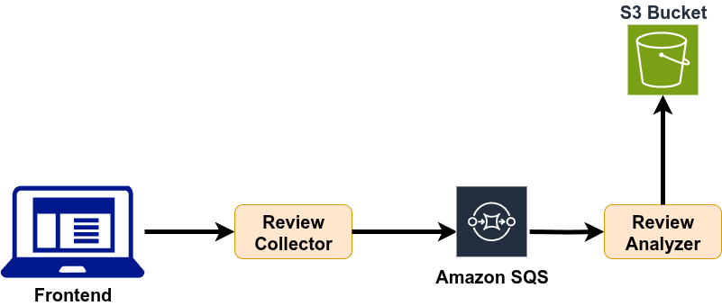

# Review Analysis Cloud Microservices - Test Containers and Localstack in practice

[](https://github.com/teixeira-fernando/Review-Analysis-Cloud-Microservices/actions/workflows/e2e-tests-release.yml)


## Table of Contents
- [Microservices](#microservices)
- [Stack](#stack)
- [Requirements to run it locally](#requirements-to-run-it-locally)
- [Instructions to run the project](#instructions-to-run-the-project)
  - [Docker - using Localstack](#docker---using-localstack)
  - [Docker - using real AWS services](#docker---using-real-aws-services)
  - [Using your favorite IDE](#using-your-favorite-ide)
- [QA Strategy](#qa-strategy)
- [Pipeline Configuration](#pipeline-configuration)
- [Development Info](#development-info)
  - [Running E2E tests using Docker alone](#running-e2e-tests-using-docker-alone)

## Microservices 

- **Review Collector**
- **Review Analyzer**



## Stack

- **Java 21**
- **Spring Boot**
- **Gradle**
- **Test Containers**
- **Localstack**
- **JUnit 5**
- **AWS (S3, SQS)**

## Requirements to run it locally

- **Docker**
- **Gradle and Java**
- **An AWS account** (if you want to run it using real services; you can use LocalStack which does not require an AWS Account)


## Instructions to run the project

There are different options to run the project:

#### 1 - Docker - using Localstack

You can simply run this docker-compose command to run the 2 services, together with the E2E tests and Localstack:

```Shell
docker-compose up --abort-on-container-exit
```

#### 2 - Docker - using real AWS services

For this option, you need to have a created AWS account and set 2 environment variables, AWS_ACCESSKEY and AWS_SECRETKEY. Depending on your machine OS, you will have a different command to set those environment variables. If you using linux, you can simply run the following:

```Shell
export AWS_ACCESSKEY=YOUR_ACCESSKEY_HERE
```

```Shell
export AWS_SECRETKEY=YOUR_SECRETKEY_HERE
```

Now, we can run this single docker command to run the 2 services and the E2E tests using real AWS services from your account.

```Shell
docker-compose -f docker-compose-real-AWS-services.yml up --abort-on-container-exit
```

#### 2 - Using your favorite IDE

You can also run the project using your favorite IDE. As mentioned, you just need the Java JDK and Gradle properly installed and configured on your machine. Let me show you how to easily run the 2 services from the project in that way.

 <b>Run review-collector service:</b>
```Gradle
./gradlew :review-collector:bootRun
```

 <b>Run review-analyzer service:</b>
```Gradle
./gradlew :review-analyzer:bootRun
```

 <b>Run E2E tests:</b>

```Gradle
./gradlew :e2e-tests:test
```

## QA Strategy

* Unit Tests: <b>Junit5 and Mockito</b>
* Integration tests: <b>Spring Boot Test, TestContainers, Localstack</b>
* E2E tests:  <b>Rest Assured, Localstack</b>
* Quality Metrics:
    * Mutation Tests/Mutation Coverage: <b>PITest</b> (TODO)
    * Code Coverage: <b>Jacoco</b> (TODO)
    * Technical Debt, Code Smells and other complementary metrics : <b>Sonar Cloud</b>
* Contract tests: <b>Pact framework</b> (TODO)
* Continuous Integration: This project uses Github Action for Continuous Integration, where it executes all the tests and Sonar Cloud Analysis for every pull request, making easier the process of integration of every new code, also facilitating the process of Code Review.

## Pipeline configuration

Even though we are using here a single repository, that is still a micro services project and that's how I tried to organize the CI/CD process to be make every service modular and independent from each other. Let's start having a look on the pipelines that are created for every Pull Request to the main branch:

* review-analyzer-pull-request
   * This pipeline builds and run the unit and integration tests from review-analyzer service.
* review-collector-pull-request
   * This pipeline builds and run the unit and integration tests from review-collector service.
* e2e-tests-pull-request:
   * This pipeline runs the E2E tests using the docker-compose configuration from file 'docker-compose.yml'.  In that config, we build the Docker images from the 2 services and the E2E tests, so then we can run it with the latest changes coming together with the PR. We also run Localstack together, so then we can have the services and the E2E tests running, without extra costs of AWS services. It would be more efficient to simply run this docker-compose configuration in the release process, but since we want to demonstrate different possibilities with Localstack, including the other configuration using real AWS services, we will use 'docker-compose.yml' here in this pull-request process.
 
 Now, let's look at the pipelines used during the release process. That means after changes are merged into the main branch:

* review-analyzer-release
   * This pipeline builds the Docker image from the review-analyzer service and pushes it to the Docker registry.
* review-collector-pull-request
   * This pipeline builds the Docker image from the review-collector service and pushes it to the Docker registry.
*  e2e-tests-release:
   *  This pipeline runs the E2E tests using the docker-compose configuration from file 'docker-compose-real-AWS-services'.  In that config, we use the latest Docker images from the 2 services and the E2E tests that were built on the 2 other release pipelines. We use real AWS services here for that test execution, and that's why we provide the AWS_ACCESSKEY and AWS_SECRETKEY into it. AS mentioned before, I could simply run my other docker-compose configuration that uses LocalStack, but i just wanted to show here the difference between both configurations.

## Development info

### Running E2E tests using Docker alone

From root folder, run the following commands:
"docker build -t my-e2e-tests . -f Dockerfile_e2e_tests"

"docker run --rm -it -e REVIEW_COLLECTOR_BASE_URL=$REVIEW_COLLECTOR_BASE_URL -e REVIEW_ANALYZER_BASE_URL=$REVIEW_ANALYZER_BASE_URL -v /var/run/docker.sock:/var/run/docker.sock my-e2e-tests"

